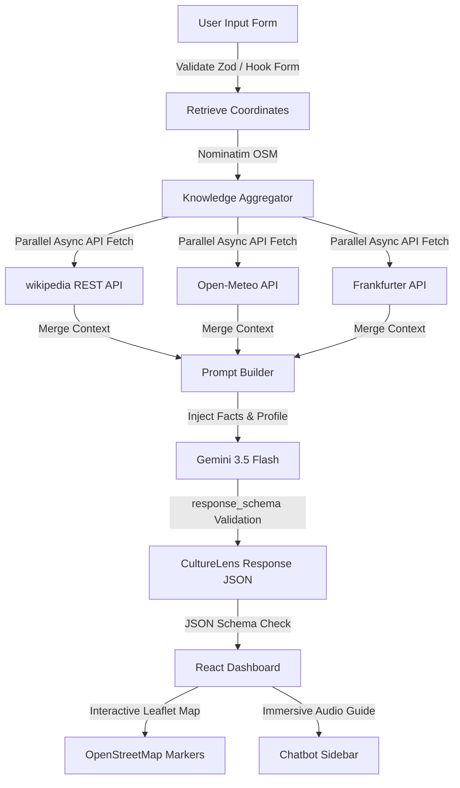

# CultureLens AI

> **"Discover destinations like a local, not a tourist."**

CultureLens AI is a production-grade, highly-optimized, and personalized Generative AI travel companion platform designed for Google's **PromptWars** Hackathon. It assists travelers in discovering authentic heritage sites, off-the-beaten-path hidden gems, and local dining traditions while creating customized daily itineraries, explaining folklore stories, and teaching local etiquette.

---

## 🏛️ System Architecture



---

## 📁 Folder Structure

```
PromptWar/
├── backend/
│   ├── app/
│   │   ├── clients/             # Factual API clients
│   │   │   ├── nominatim.py     # OSM Coordinates search
│   │   │   ├── wikipedia.py     # Heritage & summary text
│   │   │   ├── weather.py       # Open-Meteo climate stats
│   │   │   └── currency.py      # Frankfurter conversion rates
│   │   ├── prompts/
│   │   │   └── travel_prompt.py # Chat & guide prompts
│   │   ├── routers/
│   │   │   └── travel.py        # /generate & /chat routes
│   │   ├── schemas/
│   │   │   └── travel.py        # Pydantic response models
│   │   ├── services/
│   │   │   ├── gemini.py        # Gemini API client
│   │   │   └── orchestrator.py  # Concurrent orchestrator pipeline
│   │   ├── utils/
│   │   │   └── sanitization.py  # Text XSS & injection filters
│   │   ├── config.py            # CORS & server settings
│   │   └── main.py              # FastAPI app setup
│   ├── tests/                   # Pytest suite
│   ├── requirements.txt         # Pip requirements
│   └── render.yaml              # Render blueprint config
├── frontend/
│   ├── src/
│   │   ├── components/          # React layout widgets
│   │   │   ├── DiscoveryBoard.tsx # Sights, Food, and Safety Tabs
│   │   │   ├── ItineraryTimeline.tsx # Chronological itinerary with story mode
│   │   │   ├── InteractiveMap.tsx  # Leaflet OpenStreetMap markers
│   │   │   ├── InteractiveGuide.tsx # Chatbot local guide sidebar
│   │   │   ├── LoadingIndicator.tsx # Visual animated skeleton loader
│   │   │   └── ErrorMessage.tsx   # Access error boundaries
│   │   ├── types/
│   │   │   └── travel.ts        # TypeScript interface models
│   │   ├── services/
│   │   │   └── api.ts           # Fetch API hooks
│   │   ├── utils/
│   │   │   └── validation.ts    # Frontend Zod-like validations
│   │   ├── App.tsx              # Main Dashboard frame
│   │   └── main.tsx             # DOM bootstrapper
│   ├── package.json             # NPM dependencies
│   ├── tailwind.config.js       # Tailwind CSS styles
│   └── vite.config.ts           # Bundler settings
└── README.md
```

---

## 🚀 Installation & Local Setup

### Prerequisite
Ensure Python 3.11+ and Node.js 18+ are installed.

### 1. Backend Setup
1. Navigate to the backend folder:
   ```bash
   cd backend
   ```
2. Install Python dependencies:
   ```bash
   pip install -r requirements.txt
   ```
3. Copy environment configuration:
   ```bash
   cp .env.example .env
    # Populate GEMINI_API_KEY="your-gemini-api-key" in .env
    # Optionally configure GEMINI_MODEL="models/gemini-1.5-flash" (defaults to models/gemini-3.5-flash)
    ```
4. Start development server:
   ```bash
   uvicorn app.main:app --reload
   ```
   The backend will run on `http://localhost:8000`.

### 2. Frontend Setup
1. Navigate to the frontend folder:
   ```bash
   cd ../frontend
   ```
2. Install dependencies:
   ```bash
   npm install
   ```
3. Start the Vite React server:
   ```bash
   npm run dev
   ```
   Open `http://localhost:5173` in your browser.

---

## 🧪 Testing

### Backend tests
Validate geocoding API clients, sanitizers, and routing mock states using `pytest`:
```bash
cd backend
pytest
```

### Frontend tests
Verify component renders and submit handlers using `vitest`:
```bash
cd frontend
npm run test
```

---

## 🔒 Security Measures
* **Sanitization**: Regular expression checks sanitize user queries and chatbot conversation logs to strip script tags and prevent injections.
* **Information Leakage**: Raw traceback reports are hidden from endpoints; stack details are written in logs while users receive safe error responses.
* **CORS Settings**: Restricts accepted headers and origins using custom whitelist rules to prevent unauthorized API fetches.

---

## ⚡ Performance Optimization
* **Parallel Client Calls**: Utilizes `asyncio.gather` to retrieve geo, weather, exchange rates, and wiki text in parallel, reducing fetch overhead.
* **API response_schema Validation**: Directs Gemini 3.5 Flash to return schema-compliant outputs using native JSON formats, reducing context token waste and parsing retry loops.
* **Token Budget Compression**: Condenses the generated itinerary into short structural summaries before passing context to the chat guide, optimizing prompt length and reducing chatbot response latencies.
